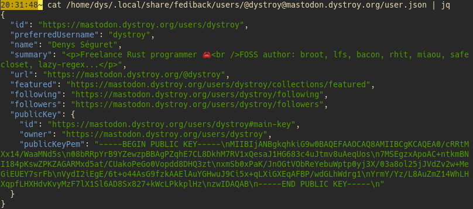
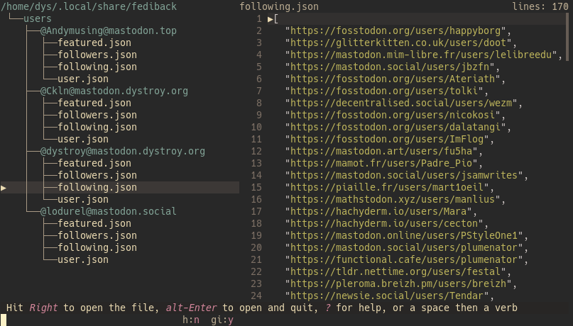

# Why fediback

A Mastodon instance can go down, and can die. This happens.

That's why users should always have essential information backuped on their own computer, most essentially their list of following and of followers.

With those lists, they can start a new account if necessary, even if their old one is unreachable, and follow again the same users, and notify people who were following them of their new account.


# Install

## From source

You must have the Rust environnement installed: https://rustup.rs

Run

```bash
cargo install fediback
```

## From precompiled binaries

*wait, I didn't prepare them yet*

# Usage


You first tell Fediback what account(s) you want to save, with `fediback add <user>` where user can be a user url or `@user@instance`:


You can add who you want: only public data is fetched.

To backup all selected accounts, run `fediback update`:


Accounts are fetched in parallel.

This operation can be done manually but there's no harm in having a cron rule if you can.

For each account 3 files are saved on disk: one with core data, the list of followers and the list of users you follow:


The main file contains only some basic info:



The `following.json` and `followers.json` files contain list of users.



# Licence

MIT - Enjoy
